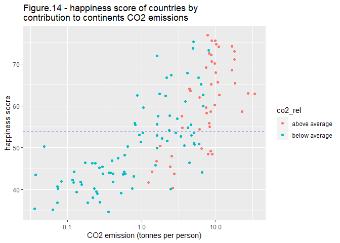

World Happiness Score vs CO2 Emissions
================
2022-06-01

Understanding the factors which attribute to happiness allow countries
with low happiness scores to implement different techniques to increase
population happiness. CO2 often has negative connotations due to it
negatively contributing to climate change, however it is often
overlooked as providing essential resources and powering technologies
which increase general well being. This report plans to draw the
connections that CO2 use can lead to happier countries.

# Set up

## Loading the libraries

``` r
knitr::opts_chunk$set(echo = TRUE)
#loading library
library(tidyverse)
library(lubridate)
library(readxl)
library(dplyr)
library(ggplot2)
library(gapminder)
library(cluster)
library(purrr)
library(infer)
library(broom)
```

## Importing data

``` r
# Data source from gapminder.org
# read in data
happiness_score <- read_xlsx("hapiscore_whr.xlsx") # source: gapminder.org/Happiness score (WHR)

co2_emissions <- read_xlsx("co2_emissions_tonnes_per_person.xlsx") # source: gapminder.org/ CO2 emissions per person
```

## Datasets

The `happiness_score` data provides a summary of the national average
response to the question of life evaluations asking the following
“Please imagine a ladder, with steps numbered from 0 at the bottom to 10
at the top. The top of the ladder represents th best possible life for
you and he bottom of the ladder represents the worst possible life for
you. On which step of the ladder would you say you personally feel you
stand at this time?” This measure is also referred to as Cantril life
ladder. Gapminder has converted this indicator’s scale from 0 to 100 to
easily communicate it in terms of percentage

``` r
head(happiness_score)
```

    ## # A tibble: 6 x 16
    ##   country  `2005` `2006` `2007` `2008` `2009` `2010` `2011` `2012` `2013` `2014`
    ##   <chr>     <dbl>  <dbl>  <dbl>  <dbl>  <dbl>  <dbl>  <dbl>  <dbl>  <dbl>  <dbl>
    ## 1 Afghani~     NA   NA     NA     37.2   44     47.6   38.3   37.8   35.7   31.3
    ## 2 Angola       NA   NA     NA     NA     NA     NA     55.9   43.6   39.4   37.9
    ## 3 Albania      NA   NA     46.3   NA     54.9   52.7   58.7   55.1   45.5   48.1
    ## 4 United ~     NA   67.3   NA     NA     68.7   71     71.2   72.2   66.2   65.4
    ## 5 Argenti~     NA   63.1   60.7   59.6   64.2   64.4   67.8   64.7   65.8   66.7
    ## 6 Armenia      NA   42.9   48.8   46.5   41.8   43.7   42.6   43.2   42.8   44.5
    ## # ... with 5 more variables: `2015` <dbl>, `2016` <dbl>, `2017` <dbl>,
    ## #   `2018` <dbl>, `2019` <dbl>

The `co2_emissions` data provides a summary of the carbon dioxide
emissions from the burning of fossil fuels (metric tonnes of CO2 per
person)

``` r
head(co2_emissions)
```

    ## # A tibble: 6 x 220
    ##   country  `1800` `1801` `1802` `1803` `1804` `1805` `1806` `1807` `1808` `1809`
    ##   <chr>     <dbl>  <dbl>  <dbl>  <dbl>  <dbl>  <dbl>  <dbl>  <dbl>  <dbl>  <dbl>
    ## 1 Afghani~     NA     NA     NA     NA     NA     NA     NA     NA     NA     NA
    ## 2 Angola       NA     NA     NA     NA     NA     NA     NA     NA     NA     NA
    ## 3 Albania      NA     NA     NA     NA     NA     NA     NA     NA     NA     NA
    ## 4 Andorra      NA     NA     NA     NA     NA     NA     NA     NA     NA     NA
    ## 5 United ~     NA     NA     NA     NA     NA     NA     NA     NA     NA     NA
    ## 6 Argenti~     NA     NA     NA     NA     NA     NA     NA     NA     NA     NA
    ## # ... with 209 more variables: `1810` <dbl>, `1811` <dbl>, `1812` <dbl>,
    ## #   `1813` <dbl>, `1814` <dbl>, `1815` <dbl>, `1816` <dbl>, `1817` <dbl>,
    ## #   `1818` <dbl>, `1819` <dbl>, `1820` <dbl>, `1821` <dbl>, `1822` <dbl>,
    ## #   `1823` <dbl>, `1824` <dbl>, `1825` <dbl>, `1826` <dbl>, `1827` <dbl>,
    ## #   `1828` <dbl>, `1829` <dbl>, `1830` <chr>, `1831` <chr>, `1832` <chr>,
    ## #   `1833` <chr>, `1834` <dbl>, `1835` <dbl>, `1836` <dbl>, `1837` <dbl>,
    ## #   `1838` <dbl>, `1839` <dbl>, `1840` <dbl>, `1841` <dbl>, `1842` <dbl>, ...

# Data Cleaning

## Transform the `happiness_score` data to long format and remove NA

``` r
happiness_score <- happiness_score %>%
  pivot_longer(-country, 
               names_to = "year", 
               values_to = "world_happiness_score", 
               values_drop_na = T) # covert from a wide format to a long format
```

## Transform the `co2_emissions` data to long format and remove NA

``` r
# The columns are a mixture of characters and values so need to convert it all to characters
co2_emissions <- co2_emissions %>%
  pivot_longer(-country, 
               names_to = "year", 
               values_to = "co2_tonnes_pp",
               values_transform = list(co2_tonnes_pp = as.character)) %>%
  na.omit() # covert from a wide format to a long format

# Then turn the column as numeric
co2_emissions$co2_tonnes_pp <- as.numeric(co2_emissions$co2_tonnes_pp)
```

## Import continents from `gapminder`

This data will help us analyse results across groups

``` r
# extract continents from gapminder
continent <- gapminder %>%
  select(country, continent) %>%
  distinct() 
```

## Merging data sets

``` r
# Merging data sets
df <- happiness_score %>%
  inner_join(co2_emissions, by = c("country", "year")) %>%
  inner_join(continent, by = c("country")) %>%
  relocate(continent, .before = year)

# change year to integer
df$year <- as.integer(df$year)

# change country to factor
df$country <- as.factor(df$country)
```

## Cleaned Data

After cleaning, this is the data we are dealing with: it contains 131
countries and 2 variables: world_happiness_score, and co2_tonnes_pp

``` r
head(df)
```

    ## # A tibble: 6 x 5
    ##   country     continent  year world_happiness_score co2_tonnes_pp
    ##   <fct>       <fct>     <int>                 <dbl>         <dbl>
    ## 1 Afghanistan Asia       2008                  37.2         0.152
    ## 2 Afghanistan Asia       2009                  44           0.238
    ## 3 Afghanistan Asia       2010                  47.6         0.29 
    ## 4 Afghanistan Asia       2011                  38.3         0.406
    ## 5 Afghanistan Asia       2012                  37.8         0.345
    ## 6 Afghanistan Asia       2013                  35.7         0.28

# Distribution of data

## What is the distribution of the World’s Happiness Score?

``` r
summary(df$world_happiness_score)
```

    ##    Min. 1st Qu.  Median    Mean 3rd Qu.    Max. 
    ##   26.60   45.60   53.20   54.53   63.70   80.20

``` r
# find the mean and median of variables for each continent
df %>% 
  group_by(continent) %>%
  summarise(mean_happiness = mean(world_happiness_score), 
            sd_happiness = sd(world_happiness_score),
            mean_co2 = mean(co2_tonnes_pp),
            sd_co2 = sd(co2_tonnes_pp))
```

    ## # A tibble: 5 x 5
    ##   continent mean_happiness sd_happiness mean_co2 sd_co2
    ##   <fct>              <dbl>        <dbl>    <dbl>  <dbl>
    ## 1 Africa              43.5        6.36      1.03   1.87
    ## 2 Americas            61.2        8.42      4.18   6.04
    ## 3 Asia                53.0        9.08      5.85   6.57
    ## 4 Europe              62.7        9.90      6.88   2.38
    ## 5 Oceania             73.1        0.958    12.9    5.04

``` r
# boxplot with colors
ggplot() + 
  geom_boxplot(data = df, aes(world_happiness_score, continent, fill = continent)) +
  scale_fill_brewer() +
  ggtitle("Figure.1 - Distribution of World Happiness Score by Continent (2005-2018)") +
  xlab("World Happiness Score")
```

<!-- -->

``` r
# histogram of world_happiness_score colored by continents
# separate histograms of world_happiness_score for each continent
df %>% 
  ggplot(aes(world_happiness_score, fill = "")) +
  geom_histogram(bins=50, show.legend = F) +
  ggtitle("Figure.3 - Distribution of World Happiness Score by Continent, 2005-2018") +
  xlab("World Happiness Score") + 
  facet_wrap(~ continent)
```

<!-- -->

## What is the distribution of the CO2 emissions (tonnes per person)?

``` r
# find distribution of the co2_tonnes_pp column
summary(df$co2_tonnes_pp)
```

    ##    Min. 1st Qu.  Median    Mean 3rd Qu.    Max. 
    ##  0.0227  0.5998  2.4950  4.4432  6.8350 35.1000

``` r
# visualize the co2_tonnes_pp by continents in a box plot
ggplot() + 
  geom_boxplot(data = df, aes(co2_tonnes_pp, continent, fill = continent)) +
  scale_fill_brewer() +
  ggtitle("Figure.4 - Distribution of CO2 Emissions by Continent (2005-2018)") +
  xlab("CO2 Emissions (tonnes per person")
```

<!-- -->

``` r
# separate histograms of co2_tonnes_pp for each continent
df %>% 
  ggplot(aes(co2_tonnes_pp, fill = "")) +
  geom_histogram(bins=50, show.legend = F) +
  ggtitle("Figure.6 - Distribution of CO2 emissions by Continent, 2005-2018") +
  xlab("CO2 emissions (tonnes per person") + 
  facet_wrap(~ continent)
```

<!-- -->

function to wrap long title

``` r
# this function is to wrap long titles so it fits within the ggplot canvas
wrapper <- function(x, ...) 
{
  paste(strwrap(x, ...), collapse = "\n")
}
```

## Top 10 Countries With Highest Average Happiness Score

``` r
# group by countries and find the mean happiness score
df %>% 
  group_by(country) %>%
  summarise(mean_happiness = mean(world_happiness_score)) %>%
  arrange(desc(mean_happiness)) %>% # sort the data in descending order
  slice(1:10) %>% # select the first 10
  ggplot(aes(x = reorder(country, mean_happiness), y = mean_happiness, fill = mean_happiness)) +
  scale_fill_gradient(low = "lightblue", high = "darkblue") + 
  geom_bar(stat = "identity", show.legend = F) + 
  coord_flip() +
  ggtitle(wrapper("Figure.7 - Top 10 Countries With Highest Average Happiness Score (according to Happiness score (WHR)), 2005-2018", width = 55)) + # use the wrapper() to wrap the title so it fits within the canvas
  ylab("Happiness Score (WHR)") +
  xlab("Country") +
  geom_text(aes(label=round(mean_happiness,2)), position = position_dodge(width = 0.9), vjust=-0.25)
```

<!-- -->

## Top 10 Countries With Highest Average CO2 Emissions

``` r
# repeat
df %>% 
  group_by(country) %>%
  summarise(mean_co2_emissions = mean(co2_tonnes_pp)) %>%
  arrange(desc(mean_co2_emissions)) %>%
  slice(1:10) %>% 
  ggplot(aes(x = reorder(country, mean_co2_emissions), y = mean_co2_emissions, fill = mean_co2_emissions)) +
  scale_fill_gradient(low = "orange", high = "red") + 
  geom_bar(stat = "identity", show.legend = F) + 
  coord_flip() +
  ggtitle(wrapper("Figure.9 - Top 10 Countries With Highest Average CO2 Emissions (tonnes per person), 2005-2018", width = 55)) +
  ylab("CO2 Emissions (tonnes per person") +
  xlab("Country") +
  geom_text(aes(label=round(mean_co2_emissions,2)), position = position_dodge(width = 0.9), vjust=-0.25)
```

<!-- -->

# Visualising the Relationship

We first use scatter plots to observe relationships between variables.

``` r
# scatter plot of co2_tonnes_pp vs world_happiness_score
ggplot() +
  geom_point(data = df, aes(x = co2_tonnes_pp, y = world_happiness_score, color = continent)) +
  scale_x_log10() + # scale the x axis
  geom_smooth(data = df, aes(co2_tonnes_pp, world_happiness_score), formula = y~x, method = "lm", color = "black") +
  xlab("CO2 Emission (tonnes per person)") + 
  ylab("Happiness Score") + 
  ggtitle("Figure.11 - Happiness Score vs CO2 Emissions (tonnes per person), 2005-2018")
```

<!-- -->

``` r
# same scatter plot but face_wrap(~ continent) to make separate graphs for each continent
df %>% 
  ggplot(aes(x = co2_tonnes_pp, y = world_happiness_score, color = continent)) +
  geom_point(show.legend = F) +
  scale_x_log10() +
  geom_smooth(formula = y ~ x, method = "lm", color = "black") + 
  facet_wrap(~ continent) +
  xlab("CO2 Emission (tonnes per person)") + 
  ylab("Happiness Score") + 
  ggtitle("Figure.12 - World Happiness Score vs CO2 Emissions (tonnes per person), 2005-2018")
```

<!-- -->

# Data Analysis

## Linear regression

We print the intercept and coefficient for the simple linear regression.

By using these values below, we can estimate the `world_happiness_score`
manually.

``` r
# Regressing world_happiness_score against co2_tonnes_pp
regression_df <- lm(world_happiness_score ~ co2_tonnes_pp, data = df) 

summary(regression_df)
```

    ## 
    ## Call:
    ## lm(formula = world_happiness_score ~ co2_tonnes_pp, data = df)
    ## 
    ## Residuals:
    ##     Min      1Q  Median      3Q     Max 
    ## -33.036  -6.479  -0.700   7.058  25.139 
    ## 
    ## Coefficients:
    ##               Estimate Std. Error t value Pr(>|t|)    
    ## (Intercept)   48.74691    0.34033  143.23   <2e-16 ***
    ## co2_tonnes_pp  1.30242    0.04975   26.18   <2e-16 ***
    ## ---
    ## Signif. codes:  0 '***' 0.001 '**' 0.01 '*' 0.05 '.' 0.1 ' ' 1
    ## 
    ## Residual standard error: 9.626 on 1382 degrees of freedom
    ## Multiple R-squared:  0.3315, Adjusted R-squared:  0.331 
    ## F-statistic: 685.3 on 1 and 1382 DF,  p-value: < 2.2e-16

The `co2_tonnes_pp` variable has a positive coefficient and its p-value
is significant at the 5% level. This means statistically, the
relationship between `world_happiness` and `co2_tonnes_pp` has a strong
positive correlation. An increase of 1 tonnes per person CO2 emission,
increases the happiness score by 1.302.

Regression equation: `world_happiness_score` = 48.75 + 1.30 x
`co2_tonnes_pp`

## Hypothesis Test

Do countries with above average CO2 emission have higher happiness
score, and if so, by how much?

From the scatter plot of Happiness Score vs CO2 Emissions, we can see
that countries with above average CO2 emissions have a higher happiness
score. This is also supported by the initial evidence from the linear
regression.

But considering developed and undeveloped economies, what if we view CO2
emissions relative to its continent average rather than the world
average?

We assigned a factor “above average” to countries with CO2 emissions
above its continent average and assigned a factor “below average” to
countries with CO2 emissions below its continent average.

Now with this factor, we can explore our research question further by
answering if a country can have high happiness score while contributing
below average CO2 emissions to its continent?

``` r
# find the continents mean happiness and co2
df_by_continent <- df %>%
  group_by(continent) %>%
  summarise(continent_happiness = mean(world_happiness_score), continent_co2 = mean(co2_tonnes_pp))

# merge the continent averages to the data
# assign factors (above average / below average)
df_by_country <- df %>%
  group_by(country, continent) %>%
  summarise(country_happiness = mean(world_happiness_score), country_co2 = mean(co2_tonnes_pp)) %>%
  inner_join(df_by_continent, by = ("continent")) %>% 
  mutate(co2_rel = case_when(country_co2 > continent_co2 ~ "above average",
                          TRUE ~ "below average"))
```

    ## `summarise()` has grouped output by 'country'. You can override using the
    ## `.groups` argument.

``` r
df_by_country$co2_rel <- as.factor(df_by_country$co2_rel)

head(df_by_country)
```

    ## # A tibble: 6 x 7
    ## # Groups:   country [6]
    ##   country  continent country_happine~ country_co2 continent_happi~ continent_co2
    ##   <fct>    <fct>                <dbl>       <dbl>            <dbl>         <dbl>
    ## 1 Afghani~ Asia                  37.0       0.270             53.0          5.85
    ## 2 Albania  Europe                49.9       1.61              62.7          6.88
    ## 3 Algeria  Africa                54.8       3.51              43.5          1.03
    ## 4 Angola   Africa                44.2       1.38              43.5          1.03
    ## 5 Argenti~ Americas              63.6       4.54              61.2          4.18
    ## 6 Austral~ Oceania               73.0      17.8               73.1         12.9 
    ## # ... with 1 more variable: co2_rel <fct>

Now with the above data we can formulate a clear hypothesis testing
question.

The Null Hypothesis is “The mean happiness of countries with above
average continent CO2 emission EQUAL to the mean happiness of countries
with below average continent CO2 emissions”

The Alternative Hypothesis is “The mean happiness of countries with
above average continent CO2 emission IS NOT EQUAL to the mean happiness
of countries with below average continent CO2 emissions”

``` r
# use t_test as the variables are continuous data
df_by_country %>% t_test(country_happiness ~ co2_rel,
               order = c("above average", "below average"),
               alternative = "two.sided")
```

    ## # A tibble: 1 x 7
    ##   statistic  t_df     p_value alternative estimate lower_ci upper_ci
    ##       <dbl> <dbl>       <dbl> <chr>          <dbl>    <dbl>    <dbl>
    ## 1      5.62  87.4 0.000000223 two.sided       10.6     6.85     14.3

P-value is statistically significance using 5% level. This infers that
there is a difference in the happiness score between countries emitting
CO2 above and below its continent’s average. We reject the null
hypothesis.

This is supported by the below output where it shows the
`mean_happiness` for above average is 60.65, which is 10.59 higher than
below average.

``` r
# find average happiness by co2_rel
df_by_country %>%
  group_by(co2_rel) %>%
  summarise(mean_happiness = mean(country_happiness))
```

    ## # A tibble: 2 x 2
    ##   co2_rel       mean_happiness
    ##   <fct>                  <dbl>
    ## 1 above average           60.6
    ## 2 below average           50.1

When we test if the happiness is higher in those countries emitting
above its continent average co2. The p-value is significant, inferring
that we reject the Null hypothesis.

``` r
df_by_country %>% t_test(country_happiness ~ co2_rel,
               order = c("above average", "below average"),
               alternative = "greater")
```

    ## # A tibble: 1 x 7
    ##   statistic  t_df     p_value alternative estimate lower_ci upper_ci
    ##       <dbl> <dbl>       <dbl> <chr>          <dbl>    <dbl>    <dbl>
    ## 1      5.62  87.4 0.000000112 greater         10.6     7.46      Inf

We can check this with an alternative hypothesis test to see if the mean
happiness of countries with above average CO2 is lower. As expected, the
p-value is really close to 1. So we failed to reject this null
hypothesis and we can infer that countries with above CO2 emissions do
not have a lower happiness score.

``` r
df_by_country %>% t_test(country_happiness ~ co2_rel,
               order = c("above average", "below average"),
               alternative = "less")
```

    ## # A tibble: 1 x 7
    ##   statistic  t_df p_value alternative estimate lower_ci upper_ci
    ##       <dbl> <dbl>   <dbl> <chr>          <dbl>    <dbl>    <dbl>
    ## 1      5.62  87.4    1.00 less            10.6     -Inf     13.7

We can also look at the relationship between `country_happiness` across
`co2_rel` to see the relationship between happiness and contribution to
continents CO2 emissions.

``` r
regress <- lm(country_happiness ~ co2_rel, df_by_country)
summary(regress)
```

    ## 
    ## Call:
    ## lm(formula = country_happiness ~ co2_rel, data = df_by_country)
    ## 
    ## Residuals:
    ##      Min       1Q   Median       3Q      Max 
    ## -20.2136  -7.9289  -0.1597   7.0929  25.2778 
    ## 
    ## Coefficients:
    ##                      Estimate Std. Error t value Pr(>|t|)    
    ## (Intercept)            60.650      1.489   40.74  < 2e-16 ***
    ## co2_relbelow average  -10.590      1.848   -5.73 6.74e-08 ***
    ## ---
    ## Signif. codes:  0 '***' 0.001 '**' 0.01 '*' 0.05 '.' 0.1 ' ' 1
    ## 
    ## Residual standard error: 10.1 on 129 degrees of freedom
    ## Multiple R-squared:  0.2029, Adjusted R-squared:  0.1967 
    ## F-statistic: 32.83 on 1 and 129 DF,  p-value: 6.736e-08

The above `summary(regress)` shows the `below average` variable is
significant at 5%. We can infer that countries who contribute CO2
emissions below its continent’s average have an average happiness score
10.59 lower than those countries who contribute above its continent
average CO2.

``` r
# visualizing with boxplots
ggplot(df_by_country, aes(country_happiness, co2_rel, fill="")) +
  scale_fill_brewer() + 
  geom_boxplot(show.legend = F) +
  xlab("Happiness Score") +
  ylab("CO2 emissions (tonnes per person)") +
  ggtitle(wrapper("Figure.13 - Happiness Score of Countries with CO2 Emissions (tonnes per person) Above vs Below Continent Average", width = 55))
```

<!-- -->

``` r
ggplot(df_by_country, aes(country_happiness, co2_rel, fill = continent)) +
  geom_boxplot() + 
  scale_fill_brewer() +
  facet_wrap(~ continent) +
  xlab("Happiness Score") +
  ylab("CO2 emissions (tonnes per person)")
```

<!-- --> \#
Extra findings When we visualized the relationship in Figure.13, we can
see the “below average” box plot has a long wick to the right indicating
there are some country with high happiness score and also contributing
below its continent average CO2 emissions.

We can visualize this with a scatter plot and add a mean happines line.

``` r
df_by_country %>%
  ggplot(aes(country_co2, country_happiness, color = co2_rel)) +
  geom_point() +
  # add horizontal line of average world happiness
  geom_hline(aes(yintercept = mean(country_happiness)),linetype="dashed", color = "blue") +
  scale_x_log10() +
  ggtitle(wrapper("Figure.14 - happiness score of countries by contribution to continents CO2 emissions", width = 50)) +
  labs(x = "CO2 emission (tonnes per person)", y = "happiness score")
```

<!-- -->
With Figure 14, we can clearly see that there are some countries who
emmits a below continent average CO2 emission and also has above average
happiness score.

It would be interesting to find out which countries these are. Lets
filter the data and call it `happy_and_green`

``` r
happy_and_green <- df_by_country[df_by_country$country_happiness > mean(df_by_country$country_happiness),] %>%
  filter(co2_rel == "below average") %>%
  arrange(desc(country_happiness))

happy_and_green %>%
  ggplot(aes(country_co2, country_happiness)) +
  geom_point() + 
  geom_text(aes(label = country, color = country), show.legend = F)
```

<!-- -->
